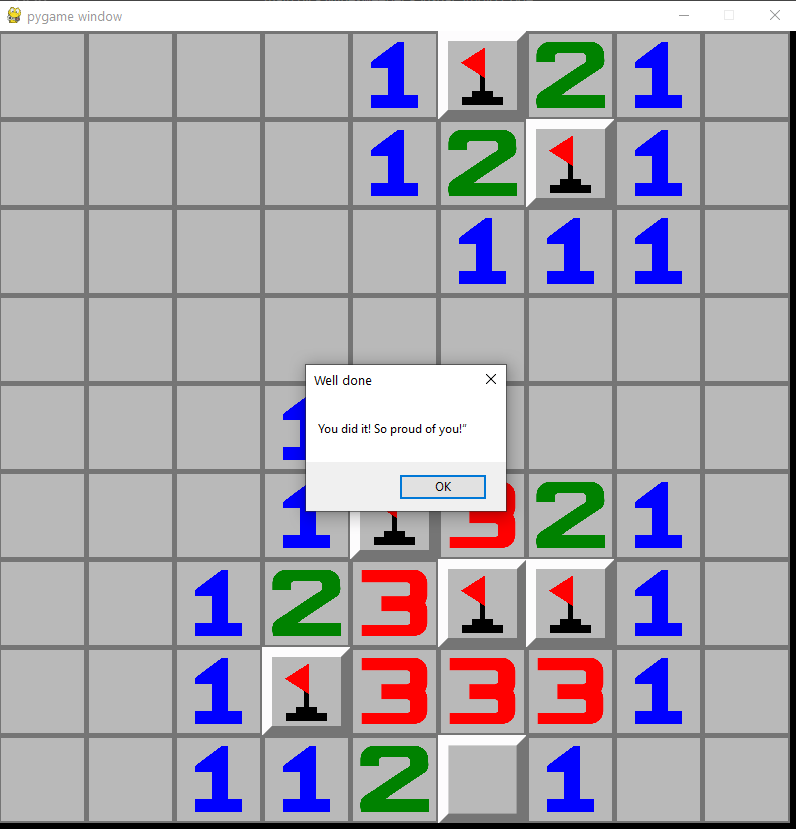
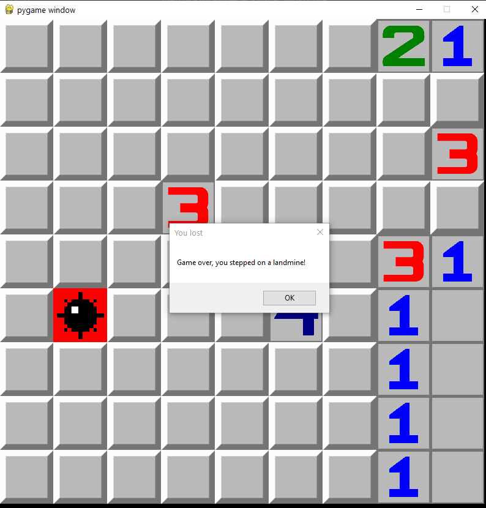

# Minesweeper - Object Oriented Programming Refresher

An OOPs refresher project that to practice the fundamentals of object-oriented programming. This project demonstrates how abstraction (hiding of details of implementation in this context) and encapsulation (grouping attributes and into a class) using multiple objects (Game, Board, Unit) makes coding a logic based board game organized and simple.

## Game Dynamics

The Minesweeper is a game where thought and chance meet and the purpose is to mark all the non-landmine units while avoiding landmines.

- Click on empty box to mark it, right-click to flag.
- Each number indicates the number of landmines around the unit.
- You win when you mark all the empty units.
- You lose when you step on a mine.

## Usage

Clone this project and execute the following commands

```
> cd Minesweeper
> python main.py
```

## Some Screenshots

###### Game Won:



###### Game Lost:



## License

[MIT](https://choosealicense.com/licenses/mit/)
